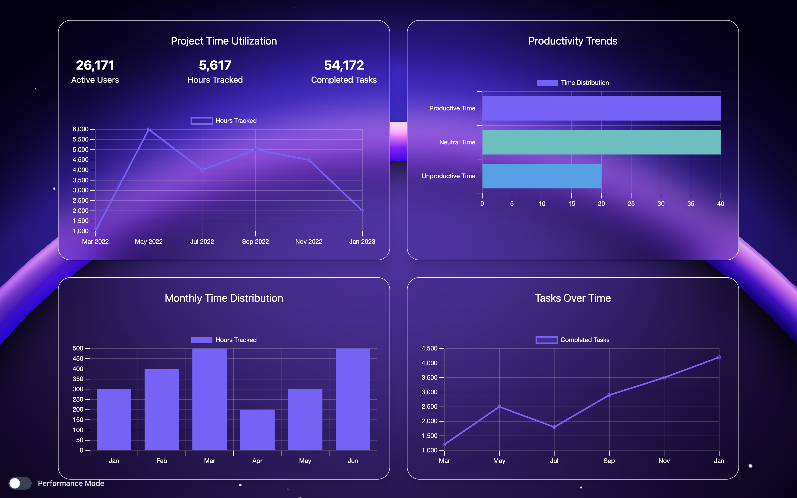

# TIME MANAGER

## TIME TRACKING APP

These three demo accounts allow you to explore and fully test the application:

Account 1
📧 johnDoe@gmail.com
🔑 password1
role: employee

Account 2
📧 janeDoe@gmail.com
🔑 password2
role: manager

Account 3
📧 aliceSmith@gmail.com
🔑 password3
role: super-manager (admin)

Log in and discover all the features! 🚀

### Project Overview

The revolt rises in the halls of Gotham town hall! Rumors of strikes and resignations run, and the main union (CGT-U, which stands for City of Gotham Trade-Union) alerts the mayor and senior officials of the town hall of the urgency of the situation:

- Employees complaining about the working conditions
- Long shifts
- The deplorable state of the city
- Batman’s lack of scruples
- ...

To calm the tensions, the town hall decides to make a state of play of the situation, and why not, to allow the municipal workers to have access to some days off to recuperate. For this, it needs to set up a time management application, that you must develop.

## User Categories

Within the company, there are three categories of users:

- **Employees**
- **Managers**
- **General Manager**

Managers have the opportunity to group their employees into teams.

## Features

### Common Features for All Users

- Edit their account information
- Delete their account
- Report their departure and arrival times
- View their dashboards

### Manager and General Manager Features

- Manage their team(s)
- View the averages of the daily and weekly hours of the team over a given period
- View the daily and weekly working hours of an employee over a period of time
- View their employees’ dashboards

### General Manager Exclusive Features

- Promote a user from the rank of employee to manager
- View the dashboards of all users
- Delete accounts from all users

## Example Dashboard

Here is an example of a dashboard, that you may or may not reproduce.



## Usage

1. Create the .env file in frontend and in source folder

2. Launch the app with docker
   dev

   ```yaml
   docker compose up -d
   ```

   prod

   ```yaml
   docker compose -f docker-compose.prod.yml up -d
   ```
